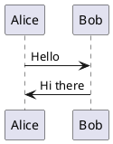
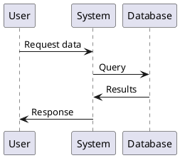

# Spring Boot PlantUML Server - Usage Guide

## Overview

This is a modern PlantUML server built with Spring Boot 3 and Java 21. It provides both a web interface and REST API for generating PlantUML diagrams and processing markdown files containing PlantUML code blocks.

## Prerequisites

- Java 21 or higher
- Maven 3.6+ (for building from source)

## Quick Start

### 1. Building the Application

```bash
# Clean and build the project
mvn clean package

# Or run without tests for faster build
mvn clean package -DskipTests
```

### 2. Starting the Server

#### Option A: Using Maven (Development)
```bash
# Run with default (dev) profile
mvn spring-boot:run

# Run with specific profile
mvn spring-boot:run -Dspring-boot.run.profiles=prod
```

#### Option B: Using JAR file (Production)
```bash
# Run the built JAR
java -jar target/springboot-plantuml-server-1.0.0.jar

# Run with specific profile
java -jar target/springboot-plantuml-server-1.0.0.jar --spring.profiles.active=prod

# Run with custom port
java -jar target/springboot-plantuml-server-1.0.0.jar --server.port=9090
```

#### Option C: Using Docker (if Docker image is built)
```bash
# Build Docker image
mvn spring-boot:build-image

# Run Docker container
docker run -p 8080:8080 plantuml-springboot-server:1.0.0
```

### 3. Accessing the Application

Once started, the application will be available at:
- **Web Interface**: http://localhost:8080/plantuml/
- **Health Check**: http://localhost:8080/plantuml/actuator/health
- **API Health Check**: http://localhost:8080/plantuml/api/health

> **Note**: The `/api/process-markdown` endpoint requires a POST request with file upload. Accessing it via browser (GET request) will result in a 405 Method Not Allowed or 500 error. Use the web interface or curl for file processing.

## Web Interface Features

### Main Page (/plantuml/)
- Upload markdown files containing PlantUML diagrams
- Process and download ZIP archives with generated diagrams
- Simple drag-and-drop interface

### Markdown Processing (/plantuml/process-markdown)
- Upload `.md` files containing PlantUML code blocks
- Automatically extracts and processes PlantUML diagrams
- Returns a ZIP file containing:
  - Original markdown file
  - Generated diagram images (PNG/SVG)
  - Processed markdown with image references

## REST API Endpoints

### Health Check
```http
GET /plantuml/api/health
```
Returns server health status. Use this endpoint to verify the API is working.

**Example:**
```bash
curl http://localhost:8080/plantuml/api/health
```

### Process Markdown File
```http
POST /plantuml/api/process-markdown
Content-Type: multipart/form-data

{
  "markdown_file": <file>
}
```

**Important**: This is a POST endpoint that requires file upload. Accessing it via browser URL (GET request) will result in an error.

**Parameters:**
- `markdown_file`: The markdown file to process (multipart form data)

**Response:**
- Success: ZIP file containing processed content and diagrams
- Error: Plain text error message

**Example using curl:**
```bash
curl -X POST \
  -F "markdown_file=@example.md" \
  -o result.zip \
  http://localhost:8080/plantuml/api/process-markdown
```

## Supported PlantUML Syntax

The server supports standard PlantUML syntax within markdown code blocks:

### Basic Example
```markdown
# My Documentation

## Architecture Diagram



## Sequence Diagram


```

### Supported Diagram Types
- Sequence diagrams
- Class diagrams
- Use case diagrams
- Activity diagrams
- Component diagrams
- State diagrams
- Object diagrams
- And more...

## Configuration Profiles

### Development Profile (dev) - Default
- Enhanced logging
- Development-friendly settings
- Hot reloading enabled

### Production Profile (prod)
- Optimized for production use
- Reduced logging
- Performance optimizations

### Docker Profile (docker)
- Container-optimized settings
- External configuration support

## Security Features

- CSRF protection for web forms
- Secure headers (HSTS, Content-Type options, etc.)
- File validation and size limits
- Session management
- Basic authentication for admin endpoints

## Monitoring and Health

### Actuator Endpoints
- `/plantuml/actuator/health` - Application health status
- `/plantuml/actuator/info` - Application information
- `/plantuml/actuator/metrics` - Application metrics (requires authentication)
- `/plantuml/actuator/prometheus` - Prometheus metrics (requires authentication)

### Health Indicators
The health endpoint provides information about:
- Application status
- Disk space
- Database connectivity (if applicable)

## File Processing Limits

### Upload Restrictions
- Maximum file size: Configurable (default settings apply)
- Supported formats: `.md`, `.markdown` files
- File validation includes content type and extension checks

### Processing Limits
- Maximum PlantUML diagrams per file: Configurable
- Timeout for diagram generation: Configurable
- Memory limits apply for large diagrams

## Troubleshooting

### Common Issues

#### Port Already in Use
```bash
# Check what's using port 8080
lsof -i :8080

# Use a different port
java -jar target/springboot-plantuml-server-1.0.0.jar --server.port=9090
```

#### Out of Memory
```bash
# Increase JVM heap size
java -Xmx2g -jar target/springboot-plantuml-server-1.0.0.jar
```

#### PlantUML Generation Errors
- Check that PlantUML syntax is valid
- Ensure all required PlantUML dependencies are available
- Check application logs for detailed error messages

### Log Locations
- Console output (default)
- Application logs: Check Spring Boot logging configuration
- Access logs: Available through actuator endpoints

## Development

### Running in Development Mode
```bash
# Enable development tools and hot reloading
mvn spring-boot:run -Dspring-boot.run.profiles=dev

# Run tests
mvn test

# Run integration tests
mvn integration-test
```

### Building for Production
```bash
# Create production-ready JAR
mvn clean package -Pprod

# Skip tests for faster builds
mvn clean package -DskipTests -Pprod
```

## Environment Variables

Common environment variables for configuration:

```bash
# Server configuration
SERVER_PORT=8080
SPRING_PROFILES_ACTIVE=prod

# Logging
LOGGING_LEVEL_ROOT=INFO
LOGGING_LEVEL_COM_EXAMPLE_PLANTUML=DEBUG

# Security
SPRING_SECURITY_USER_NAME=admin
SPRING_SECURITY_USER_PASSWORD=secret
```

## Support and Documentation

For additional help:
1. Check the application logs for detailed error messages
2. Review Spring Boot documentation for configuration options
3. Visit PlantUML official documentation for diagram syntax
4. Check actuator endpoints for application health and metrics

## Version Information

- Application Version: 1.0.0
- Spring Boot Version: 3.3.4
- Java Version: 21
- PlantUML Version: 1.2025.4
